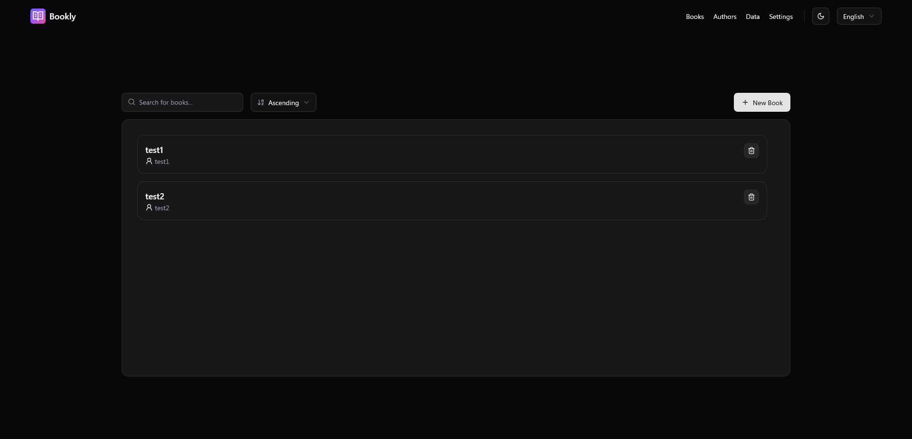

# Bookly


---

> [!WARNING]
> **Work in Progress**: This project is currently under development. Not all features may be fully implemented or working as expected.

Bookly is a modern full-stack desktop application for managing and browsing your book and author collection. Built with React 19, TypeScript, Tauri v2, Express.js, and Vite, it features a clean UI with shadcn/ui components, internationalization support (Arabic/English), theme switching, sorting, searching, and comprehensive book and author management capabilities.



## Features

### 📚 Book & Author Management

- Browse your book collection in a beautiful card layout
- Manage authors with dedicated author pages and profiles
- Search for books by title or author
- Sort books and authors in ascending or descending order
- Add and delete books and authors with intuitive dialogs
- Individual book and author detail pages
- Multi-page navigation (Books, Authors, Data, Settings)

### 🖥️ Native Desktop App

- Cross-platform desktop application powered by Tauri v2
- Native window controls and system integration
- Small bundle size and fast startup
- Runs on Windows, macOS, and Linux

### 🌐 Internationalization

- Multi-language support (English and Arabic)
- Automatic language detection
- Right-to-left (RTL) support for Arabic
- Language switcher in navigation
- Localized UI components and content

### 🎨 Modern UI/UX

- Desktop-focused design with clean interface
- Dark/Light theme support with theme switcher
- Modern UI components powered by shadcn/ui and Radix UI
- Responsive navigation with dropdown menus
- Clean card-based layouts for books and authors
- Smooth transitions and animations

### 🛠 Technical Features

- Full-stack architecture with Express.js backend
- React 19 with TypeScript for type safety
- Internationalization with i18next and react-i18next
- RTL support with Radix UI DirectionProvider
- RESTful API for books and authors management
- TailwindCSS for utility-first styling
- Vite for fast development and optimized builds
- Component-based architecture with reusable UI elements
- Modern routing with React Router DOM v7

## Tech Stack

### Frontend

- **React 19** - Modern React with latest features
- **TypeScript** - Type-safe development
- **Vite** - Fast build tool and dev server
- **TailwindCSS v4** - Utility-first CSS framework
- **shadcn/ui** - Beautiful and accessible UI components
- **Radix UI** - Primitive UI components with RTL support
- **React Router DOM v7** - Modern client-side routing
- **i18next** - Internationalization framework
- **react-i18next** - React integration for i18next
- **Lucide React** - Beautiful icons

### Backend

- **Express.js v5** - Fast and minimal web framework
- **Vite Express** - Integration between Vite and Express
- **Node.js** - JavaScript runtime
- **JSON File Storage** - Simple file-based data storage for books and authors

### Desktop

- **Tauri v2** - Lightweight cross-platform desktop framework
- **Rust** - Backend runtime for native performance
- **WebKitGTK** - Web view for Linux
- **WebView2** - Web view for Windows

## Getting Started

### Prerequisites

- Node.js (v18 or newer recommended)
- pnpm (recommended package manager)
- Rust (for Tauri development)
- System dependencies for Tauri:
  - **Linux**: `libwebkit2gtk-4.1-dev libgtk-3-dev libayatana-appindicator3-dev librsvg2-dev`
  - **Windows**: WebView2 (usually pre-installed on Windows 10/11)
  - **macOS**: Xcode Command Line Tools

### Installation

1. Clone the repository:

   ```sh
   git clone https://github.com/Salafi-Coders/bookly.git
   cd bookly
   ```

2. Install dependencies for all workspaces:

   ```sh
   pnpm install:all
   ```

3. Start the development server (web):

   ```sh
   pnpm dev
   ```

4. Start the desktop app (Tauri):

   ```sh
   pnpm tauri dev
   ```

5. Open [http://localhost:5173](http://localhost:5173) in your browser (for web version).

### Available Scripts

From the root directory:

- `pnpm dev` - Start development server (both client and server)
- `pnpm build` - Build the client for production
- `pnpm start` - Start production server
- `pnpm install:all` - Install dependencies for both client and server
- `pnpm build:production` - Build and start production server
- `pnpm tauri dev` - Start Tauri desktop app in development mode
- `pnpm tauri build` - Build the desktop app for production
- `pnpm tauri icon <path>` - Generate app icons from a source image

## Project Structure

```text
bookly/
├── client/                 # React frontend application
│   ├── src/
│   │   ├── components/     # Reusable React components
│   │   │   ├── ui/         # shadcn/ui components
│   │   │   ├── books/      # Book-related components
│   │   │   ├── authors/    # Author-related components
│   │   │   └── navbar/     # Navigation components
│   │   ├── pages/          # Page components
│   │   │   ├── books/      # Books page and routing
│   │   │   ├── authors/    # Authors page and routing
│   │   │   ├── book/       # Individual book page
│   │   │   ├── author/     # Individual author page
│   │   │   ├── data/       # Data visualization page
│   │   │   └── settings/   # Settings page
│   │   ├── lib/            # Utility functions and helpers
│   │   ├── assets/         # Static assets (images, logos)
│   │   └── i18n.js         # Internationalization configuration
│   ├── public/
│   │   └── locales/        # Translation files
│   │       ├── en.json     # English translations
│   │       └── ar.json     # Arabic translations
│   └── package.json        # Client dependencies and scripts
├── server/                 # Express.js backend
│   ├── data/               # JSON data files
│   │   ├── books.json      # Books data
│   │   └── authors.json    # Authors data
│   ├── lib/                # Server utilities and modules
│   ├── routes/             # API route handlers
│   ├── server.js           # Main server file
│   └── package.json        # Server dependencies and scripts
├── src-tauri/              # Tauri desktop application
│   ├── src/                # Rust source files
│   │   ├── main.rs         # Main entry point
│   │   └── lib.rs          # Library module
│   ├── icons/              # Application icons
│   ├── tauri.conf.json     # Tauri configuration
│   └── Cargo.toml          # Rust dependencies
└── package.json           # Workspace configuration
```

## Development

### Adding New Components

This project uses shadcn/ui for UI components. To add new components:

```sh
cd client
npx shadcn@latest add [component-name]
```

### Language Support

The application supports multiple languages with automatic detection:

- **English (en)** - Default language
- **Arabic (ar)** - Full RTL support with proper text direction

To add a new language:

1. Create a new file `client/public/locales/[language-code].json`
2. Add translated strings to the JSON file
3. The application will automatically detect and switch based on browser preferences

### API Endpoints

The server provides RESTful API endpoints:

- `GET /api/books` - Retrieve all books
- `POST /api/books` - Create a new book
- `DELETE /api/books/:id` - Delete a book
- `GET /api/authors` - Retrieve all authors
- `POST /api/authors` - Create a new author
- `DELETE /api/authors/:id` - Delete an author

### Customization

- **Books Data**: Edit `server/data/books.json` to modify the book collection
- **Authors Data**: Edit `server/data/authors.json` to manage authors
- **Translations**: Add or modify translations in `client/public/locales/`
- **UI Styling**: Customize components in `client/src/components/ui/`
- **Theme**: Configure themes in `client/src/components/themeprovider.tsx`
- **API Routes**: Add backend routes in `server/routes/`
- **Internationalization**: Configure i18n in `client/src/i18n.js`

### Pages

The application includes multiple pages with full internationalization:

- **Books**: Book collection browser and management with search and sort
- **Authors**: Author management with individual author profiles
- **Individual Book Pages**: Detailed view for each book with notes and metadata
- **Individual Author Pages**: Detailed author profiles and their works
- **Data**: Data visualization and analytics dashboard
- **Settings**: Application configuration, theme, and language preferences

## Contributing

Contributions are welcome! Please feel free to submit a Pull Request. For major changes, please open an issue first to discuss what you would like to change.

### Development Guidelines

- Follow TypeScript best practices
- Use the existing component structure and patterns
- Ensure internationalization support for new features
- Test both LTR and RTL layouts
- Maintain consistent styling with shadcn/ui components

## License

MIT

## Acknowledgments

- [Tauri](https://tauri.app/) for the lightweight desktop framework
- [shadcn/ui](https://ui.shadcn.com/) for the beautiful UI components
- [Radix UI](https://radix-ui.com/) for accessible primitives
- [Lucide](https://lucide.dev/) for the icon set
- [i18next](https://www.i18next.com/) for internationalization
